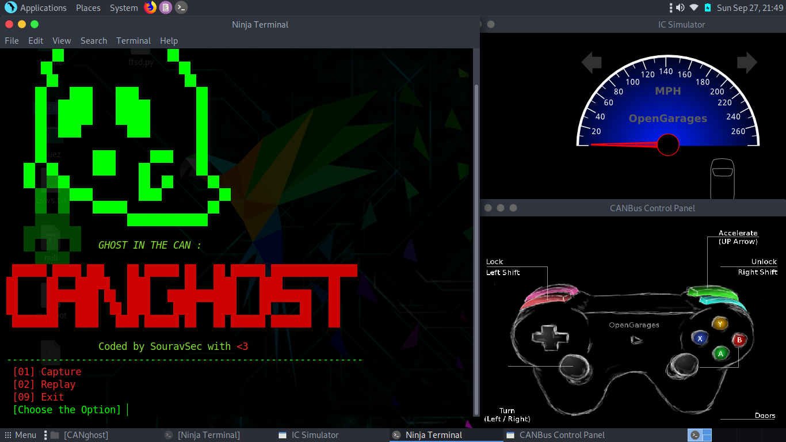

<p align="center">
  
</p>

<h1 align="center"> <b>CANghost</b></h1>
<h3 align="center"><b>An Automated Tool For Hacking Into CAN Bus - Car Hacking</b></h3> 

### Requirements:

* Any Linux Distributions (Ubuntu is Recommended)
* can-utils
* [ICSim - Car Simulation](https://github.com/souravbaghz/ICSim)
***

#### can-utils is a Linux specific set of utilities that enables Linux to communicate with the CAN network on the vehicle. The canutils consist of 5 main tools that we use very frequently:
- cansniffer for sniffing the packets
- cansend for writing a packet
 candump dump all received packets
- canplayer to replay CAN packets
- cangen to generate random CAN packets
 + **can-utils can be installed via apt-get**
 ```
 sudo apt-get install can-utils -y
 ```
 ***
 
 + **Installation of CANghost :**
 ```
 git clone https://github.com/souravbaghz/CANghost
 ```
 + **Usage:**
 ```
 cd CANghost/
 bash canghost.sh <interface> <logfilename>
 Example- bash canghost.sh vcan0 demolog
 ```
 ### Note: First Install & Run [ICSim](https://github.com/SouravSec/ICSim) then run canghost.sh
 
 <p align="center">
  
</p>

 ***
 <h3 align="center"><b>A Quick Tutorial</b></h3> 
 
 + **Preparing the Virtual CAN Network:**
 ```
 ubuntu@sourav:~/ICSim$./setup_vcan.sh
 ```
 
  **Running the Simulator:**
 * Running the dashboard
```
 ubuntu@sourav:~/ICSim$./icsim vcan0
```
 
 * Control Panel can be started by
 ```
  ubuntu@sourav:~/ICSim$./controls vcan0
 ```
 
 + **Now Start the CANghost:**
 ```
 ubuntu@sourav:~/CANghost$./canghost.sh vcan0 mylog
 ```
 #### Now choose the option you want and play with your Virtual Car.
 
 ***[Click Here](https://youtu.be/HLWc_b1vHWg) to Watch Tutorials on Youtube***
 
 ***
 
 ### If You Do Love My Works Then You Can Buy Me A Coffee Now.
 <a href="https://www.buymeacoffee.com/souravbaghz" target="_blank"></a>
 
 ***
 ## About CANghost:
 I made this tool to automate the process and save my time while hacking or practicing. The script first dump all the CAN packets in **Capture** option and Replay that packets(logfile) into Car in **Replay** option. Don't play with Real car, I always recommend to use on Simulator. I made this tool for learning & personal purpose, If you want to do it manually then you can check code source to understand how it works... 
 
 ***Thanks to [@zombieCraig](https://github.com/zombieCraig) for ICSim***
 
 
 [![!#/bin/bash](https://img.shields.io/badge/-%23!%2Fbin%2Fbash-1f425f.svg?style=for-the-badge&logo=image%2Fpng%3Bbase64%2CiVBORw0KGgoAAAANSUhEUgAAABgAAAAYCAYAAADgdz34AAAAGXRFWHRTb2Z0d2FyZQBBZG9iZSBJbWFnZVJlYWR5ccllPAAAAyZpVFh0WE1MOmNvbS5hZG9iZS54bXAAAAAAADw%2FeHBhY2tldCBiZWdpbj0i77u%2FIiBpZD0iVzVNME1wQ2VoaUh6cmVTek5UY3prYzlkIj8%2BIDx4OnhtcG1ldGEgeG1sbnM6eD0iYWRvYmU6bnM6bWV0YS8iIHg6eG1wdGs9IkFkb2JlIFhNUCBDb3JlIDUuNi1jMTExIDc5LjE1ODMyNSwgMjAxNS8wOS8xMC0wMToxMDoyMCAgICAgICAgIj4gPHJkZjpSREYgeG1sbnM6cmRmPSJodHRwOi8vd3d3LnczLm9yZy8xOTk5LzAyLzIyLXJkZi1zeW50YXgtbnMjIj4gPHJkZjpEZXNjcmlwdGlvbiByZGY6YWJvdXQ9IiIgeG1sbnM6eG1wPSJodHRwOi8vbnMuYWRvYmUuY29tL3hhcC8xLjAvIiB4bWxuczp4bXBNTT0iaHR0cDovL25zLmFkb2JlLmNvbS94YXAvMS4wL21tLyIgeG1sbnM6c3RSZWY9Imh0dHA6Ly9ucy5hZG9iZS5jb20veGFwLzEuMC9zVHlwZS9SZXNvdXJjZVJlZiMiIHhtcDpDcmVhdG9yVG9vbD0iQWRvYmUgUGhvdG9zaG9wIENDIDIwMTUgKFdpbmRvd3MpIiB4bXBNTTpJbnN0YW5jZUlEPSJ4bXAuaWlkOkE3MDg2QTAyQUZCMzExRTVBMkQxRDMzMkJDMUQ4RDk3IiB4bXBNTTpEb2N1bWVudElEPSJ4bXAuZGlkOkE3MDg2QTAzQUZCMzExRTVBMkQxRDMzMkJDMUQ4RDk3Ij4gPHhtcE1NOkRlcml2ZWRGcm9tIHN0UmVmOmluc3RhbmNlSUQ9InhtcC5paWQ6QTcwODZBMDBBRkIzMTFFNUEyRDFEMzMyQkMxRDhEOTciIHN0UmVmOmRvY3VtZW50SUQ9InhtcC5kaWQ6QTcwODZBMDFBRkIzMTFFNUEyRDFEMzMyQkMxRDhEOTciLz4gPC9yZGY6RGVzY3JpcHRpb24%2BIDwvcmRmOlJERj4gPC94OnhtcG1ldGE%2BIDw%2FeHBhY2tldCBlbmQ9InIiPz6lm45hAAADkklEQVR42qyVa0yTVxzGn7d9Wy03MS2ii8s%2BeokYNQSVhCzOjXZOFNF4jx%2BMRmPUMEUEqVG36jo2thizLSQSMd4N8ZoQ8RKjJtooaCpK6ZoCtRXKpRempbTv5ey83bhkAUphz8fznvP8znn%2B%2F3NeEEJgNBoRRSmz0ub%2FfuxEacBg%2FDmYtiCjgo5NG2mBXq%2BH5I1ogMRk9Zbd%2BQU2e1ML6VPLOyf5tvBQ8yT1lG10imxsABm7SLs898GTpyYynEzP60hO3trHDKvMigUwdeaceacqzp7nOI4n0SSIIjl36ao4Z356OV07fSQAk6xJ3XGg%2BLCr1d1OYlVHp4eUHPnerU79ZA%2F1kuv1JQMAg%2BE4O2P23EumF3VkvHprsZKMzKwbRUXFEyTvSIEmTVbrysp%2BWr8wfQHGK6WChVa3bKUmdWou%2BjpArdGkzZ41c1zG%2Fu5uGH4swzd561F%2BuhIT4%2BLnSuPsv9%2BJKIpjNr9dXYOyk7%2FBZrcjIT4eCnoKgedJP4BEqhG77E3NKP31FO7cfQA5K0dSYuLgz2TwCWJSOBzG6crzKK%2BohNfni%2Bx6OMUMMNe%2Fgf7ocbw0v0acKg6J8Ql0q%2BT%2FAXR5PNi5dz9c71upuQqCKFAD%2BYhrZLEAmpodaHO3Qy6TI3NhBpbrshGtOWKOSMYwYGQM8nJzoFJNxP2HjyIQho4PewK6hBktoDcUwtIln4PjOWzflQ%2Be5yl0yCCYgYikTclGlxadio%2BBQCSiW1UXoVGrKYwH4RgMrjU1HAB4vR6LzWYfFUCKxfS8Ftk5qxHoCUQAUkRJaSEokkV6Y%2F%2BJUOC4hn6A39NVXVBYeNP8piH6HeA4fPbpdBQV5KOx0QaL1YppX3Jgk0TwH2Vg6S3u%2BdB91%2B%2FpuNYPYFl5uP5V7ZqvsrX7jxqMXR6ff3gCQSTzFI0a1TX3wIs8ul%2Bq4HuWAAiM39vhOuR1O1fQ2gT%2F26Z8Z5vrl2OHi9OXZn995nLV9aFfS6UC9JeJPfuK0NBohWpCHMSAAsFe74WWP%2BvT25wtP9Bpob6uGqqyDnOtaeumjRu%2ByFu36VntK%2FPA5umTJeUtPWZSU9BCgud661odVp3DZtkc7AnYR33RRC708PrVi1larW7XwZIjLnd7R6SgSqWSNjU1B3F72pz5TZbXmX5vV81Yb7Lg7XT%2FUXriu8XLVqw6c6XqWnBKiiYU%2BMt3wWF7u7i91XlSEITwSAZ%2FCzAAHsJVbwXYFFEAAAAASUVORK5CYII%3D)](https://www.gnu.org/software/bash/)
 
 <br>

### 🤝 Connect with me
[](https://www.instagram.com/souravbaghz)
[](https://github.com/souravbaghz)
[](https://twitter.com/souravbaghz)
[](https://medium.com/@souravbaghz)

---
